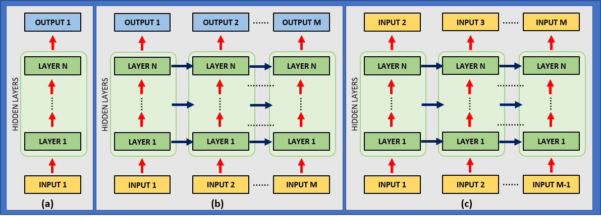

# Generating new music in the style of Bach's chorales

I'm sure by now you have seen examples of AI applications where an algorithm is left to train for some time on a large corpus of text or music and can then be used to create new content following the same style. This project is my take on training a neural network on the full set of JS Bach's four-part chorale pieces and then using it to create some new, original music.

Bach was a tremendously prolific composer, with a large volume of music written for many different instruments and in a variety of formats. His chorales are a set of roughly 400 different pieces in four-part harmony for soprano, alto, tenor and bass voices. With such a large corpus of music, it is not very far-fetched to think that a sufficiently capable application can, over many iterations, learn enough music to produce some original and interesting new tunes.

The typical way to create this type of application is to chop up the full corpus of music into small chunks of notes, feed them sequentially into a Recurrent Neural Network (RNN), and at each step have the network predict what will be the following note. Every few chunks, the network suffers minor adjustments to nudge its predictions in the direction of the true notes. Many iterations later, it gets pretty good at predicting the next note following a given sequence. At this stage, it can be used to generate new music, one note at a time, by repeatedly taking the network's prediction and feeding it back into itself.

For this project I used Python and the Keras & TensorFlow duo. A notebook with the full code and a detailed description of what's going on in available [here](https://github.com/fabio-a-oliveira/music-generator/blob/main/bach_chorales.ipynb). If you just want to listen to some music, you can jump right to [this section](#Results-and-new-music-generation).

***

## The gist of Recurrent Neural Nets (RNNs)

Recurrent Neural Networks are a modification of the traditional "vanilla" Neural Networks with two important distinctions:

1. Each layer provides two distinct outputs: the normal output vector, typically passed on to another layer or interpreted as the network's prediction AND a state vector, which will be used by the same layer on the next prediction step;
2. The network is applied to each instance of a sequence of inputs, with each of its layers operating not only on its inputs, but also on the state vector received from the previous step.

The following image illustrates the distinctions:

_**FIGURE 1** (a) A conventional Neural Network processes data by having the input pass through a series of layers until it produces an output. It can be repeated for each step of a sequence, but there is no communication between steps. (b) A Recurrent Neural Network extends this process to a sequence of inputs, with each layer transmiting its results upwards through the network (red arrows) and to itself on the next step (blue arrows). (c)  A RNN can be applied to a sequence of inputs to predict, at each step, the next entry._

If you are interested in finding out more about RNNs, there's a [phenomenal blog post](http://karpathy.github.io/2015/05/21/rnn-effectiveness/) by Andrej Karpathy (head of AI at Tesla) with a great explanation about their principles and many examples of fun applications. You can also check out a more formal approach in the [Sequence Modeling - Recurrent and Recursive Nets](https://www.deeplearningbook.org/contents/rnn.html) chapter of the [Deep Learning](https://www.deeplearningbook.org/) book.

***

## Preparing the data, creating and training the model

* __The dataset:__ the full dataset is composed of 382 chorales, divided into 229 pieces for training, 77 for validation and 76 for testing. Each piece contains a sequence of entries for each of the four voices (soprano, alto, tenor and bass), encoded as integers from 36 (C in octave 1) to 81 (A in octave 4). The encoding considers an uniform note duration of half a beat.    
       

* __Preprocessing:__ each note is layed out sequentially (1st note of the soprano, 1st note of the tenor, 1st note of the alto, 1st note of the bass, 2nd note of the soprano etc). A series of four -1 entries are appended to the end of each file to indicate the end of a piece and then they are all concatenated together into a single sequence. The full dataset is then encoded in a one-hot representation.     
     
      
* __Data augmentation:__ in order to provide a larger variety of data to the learning algorithm, at each epoch the pieces are randomly transposed to another octave. This results in a much richer dataset, increases robustness of the learning process and the ability to pick up patterns in any musical key.     
     
     
* __The model:__ it  is composed of a stack of 3 Gated Recurrent Units (a particular architecture of RNN) with layer normalization, followed by a softmax unit that calculates the probability that each of the possible notes is next in the sequence. There is a total of roughly 516 thousand trainable parameters.     
     
     
* __Training:__ the model is trained with the ADAM optimizer and a decaying learning rate. Gradient clipping is applied to stabilize training.  At the end of each epoch, the performance is evaluated on the validation set and training stops when a number of steps passes without any performance improvement. Training took a little over 2 days on a typical CPU.     
     
     
* __Performance metric:__ at each step, the model predicts the probability that each possible note is the next one. It is evaluated according to its ability to output a high probability to the correct note.

This is a rather superficial description of the model. Again, you are welcome to check out the Python implementation here.

***

## Results and new music generation

After a lot of waiting (and, frankly, watching several versions of the model training on TensorBoard as if it was a series on Netflix), we have a model that can be used for creating new music. 

> At the end of the training process, the model achieves aroung 86% accuracy on the test set. This means that, given a piece of music, it can correctly point out which will be the next note 86% of the times __on pieces that is has not seen during training__! 

This shows that the network didn't simply memorize a bunch of music and learned to regurgitate it on request. It actually learned enough about Bach's style to be able to reach a very high level of accuracy in a piece of music it has never seen before. Moreover, it is typically able to correctly pinpoint the next note with around 63% certainty - really impressive, considering that there are more than 50 possible notes in its vocabulary!

With the model properly trained, we can now use it to generate original music. We can start by feeding the model with a null input and selecting a note randomly, according to the probabilities it calculates. We can then feed the new note into the model and randomly select the another one. By repeatedly inputing the previously selected note into the model in order to select a new one, we can use the network indefinetly to create new music. Alternatively, we can make use of the fact that the model was trained with a sequence of -1 to indicate the end of a piece, and simply extract new notes until the network outputs an end-of-file token.

After a chunk of music is extracted from the model, we create a MIDI file and add the notes to it. MIDI is a simple to use protocol for encoding digital music and lends itself very well for this application. 

As an aesthetic choice, I opted to use legatos to encode the same note when it is repeated by the same voice. As an example, this means that if the soprano voice sings the same note twice, the file will actually play it only once with twice the duration.

<!---
Include more examples and discuss: effect of temperature, some have wrong notes, some are too short, some end abruptly
--->

These are some of my favorite pieces generated by the algorithm. Sounds pretty baroque to me!

<midi-player
  src="2021-03-10_new_chorale__2021-03-08__12-26-39__051__.mid"
  sound-font = "https://storage.googleapis.com/magentadata/js/soundfonts/sgm_plus">
</midi-player>

<midi-player
  src="2021-03-10_new_chorale__2021-03-08__12-26-39__059__.mid"
  sound-font = "https://storage.googleapis.com/magentadata/js/soundfonts/sgm_plus">
</midi-player>

***

## Conclusion:

This has been a fun project! It was my first experiment with RNNs, so I didn't want to get too fancy, but there are lots of other elements that can be incorporated in a next project (embedding and convolutional layers are the first things to come to mind).

It took me a few days to work out the basic architecture of the model and a few weeks to tweak the particulars of the architecture and the hyperparameters (how many layers, how many units in each layer, the learning rate and its decay schedule, the dropout rate, the length of the music chunks given to the model and the amount of chunks per training step, the proper way to do data augmentation, the proper amount of gradient clipping and a bunch of other minor adjustments).

In my estimation, reaching a 85% accuracy rate is really something! I imagine that even better results could have been attained with a larger model. This particular version has a total of roughly 240 thousand trainable parameters, which is not a particularly high number by modern standards, but certainly required a lot of computational power for a personal application. With all the bells and whistles, it takes a little over 20 hours to train the model with my setup.

This project has been elicited by an end-of-chapter exercise proposed in the excelent [Hands-On Machine Learning with Scikit-Learn, Keras & TensorFlow](https://www.oreilly.com/library/view/hands-on-machine-learning/9781492032632/) book. The author's implementation can be found in [his Python notebook on GitHub](https://github.com/ageron/handson-ml2/blob/master/15_processing_sequences_using_rnns_and_cnns.ipynb). His model is quite different than mine (he used a 5-dimensional embedding, a stack of convolutional layers of doubling dilation rates, a recurrent layer and a dense output) and he wrote his own synthetiser instead of using MIDI. He also does not do any data augmentation. Anyway, if you're interested in this sort of thing, I can't recommend his book enough.
