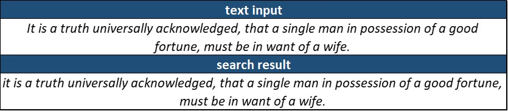
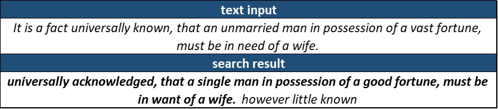
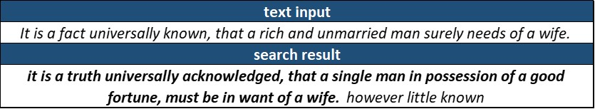
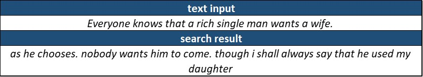
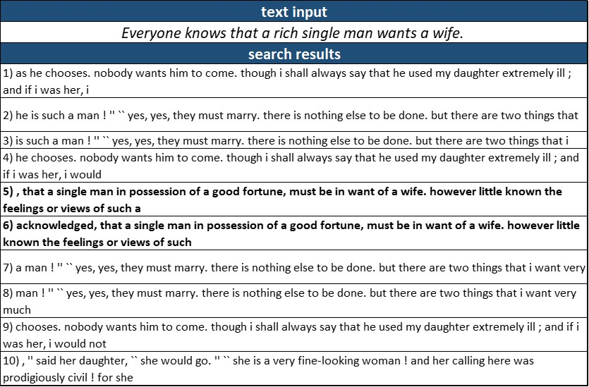
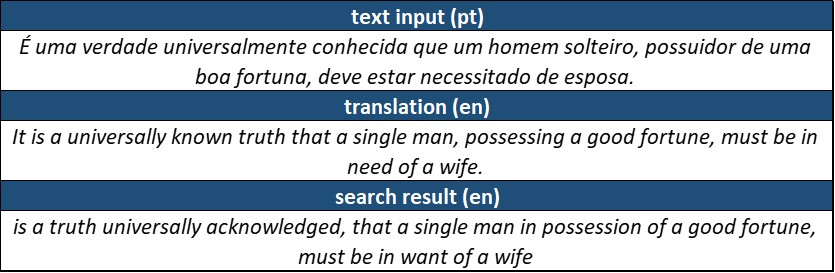
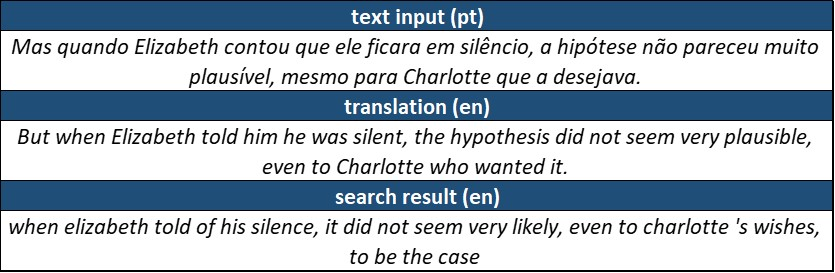
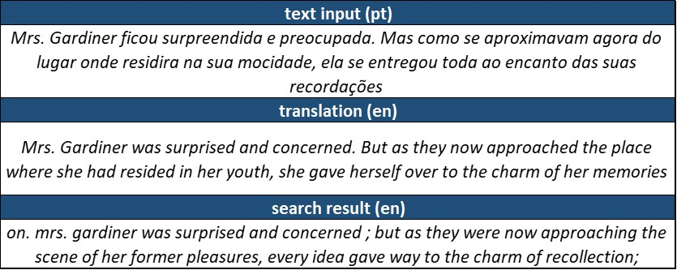
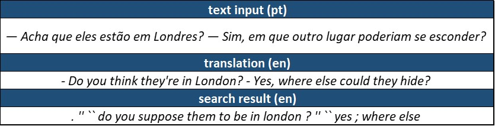
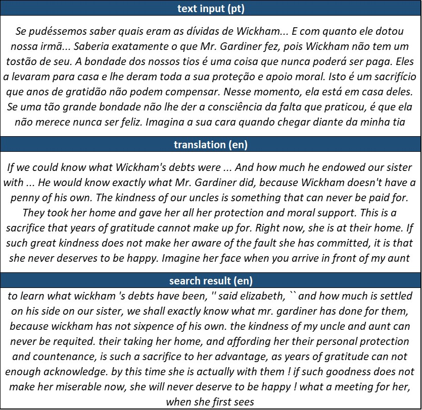

<html>
    <head>
        <title>Beyond CTRL+F</title>
    </head>

    <body>
        <h1>Beyond CTRL+F</h1>
        
<i>Using word embeddings to implement a semantic search within a document</i>

        <h2>Introduction</h2>

        
We are all used to the situation where we need to find a piece of text within a document, but can’t quite remember exactly what it is. We may recall some of the important words or the overall meaning of the passage, but most text processors (from Notepad to Microsoft Word) only allow us to do lexical search (i.e. searching the text for an exact match to our provided input). There is really no way around it: the only way to find what we’re looking for is hitting <code>CTRL+F</code> (or some equivalent combination depending on your system) to search for a word or small expression and browse through a potentially large list of results until we find the one that corresponds to whatever it is we were looking for.

        
        
The practice can be even more inconvenient when we are not certain on the some of the exact words contained in the target results. We may need to search for combinations of different synonims and different word ordering until we find a match.

        
I’ve recently been toying a lot with the idea of comparing excerpts of text based on their meaning rather than the exact words. It is evident that different passages of text can hold very similar meanings, while at the same time using different words, expressions and word arrangement. It is also the case that sometimes a passage is modified, but a human reader can easily identify where it is derived from. And yet, algorithmically identifying the equivalence between them is not at all a trivial task.

    
        
In this article, we’ll apply a technique that combines <i><b>word embeddings</b></i> and <i><b>parts-of-speech filtering</b></i> to implement a semantic search within a document. To illustrate how the technique works and the sort of results we can obtain, we’ll try searching Jane Austen’s Pride and Prejudice for several excerpts of text that do not contain an exact match within the book. In the first application, we’ll start with the first sentence in the book and search for incrementaly altered versions, until the phrase is reduced to its bare minimum. Then, we’ll take passages from the Brazilian Portuguese translation, revert them to English with a simple call to Google Translate, and try to locate the passages in the original text.

    
        
I’ll not go into details of the Python implementation in this article. If you’re interested, you can check out a detailed notebook on GitHub <a href="https://github.com/fabio-a-oliveira/semantic-search/blob/main/semantic_search.ipynb">here</a>. You can also open it right on Google Colab via , which will allow you to use a simple form to run some examples by yourself on any work in the <a href="https://www.gutenberg.org/">Project Gutenberg</a> catalogue of public domain books.

    
        

    
        <h2>The Method</h2>

        
Here is the sequence of steps we’ll be taking to locate a passage of equivalent meaning within a book:

        <ol>
            <li>Use <i><b>word embeddings</b></i> to convert every word in the book and the requested sentence to a dense vector representation (in this case, we’ll use <a href="https://nlp.stanford.edu/projects/glove/">Glove</a> embeddings). This representation captures the meaning of a word in a 300-dimensions vector space. If you’re not confident on what the term ‘word embedding’ means, I highly recommend you spend a few minutes playing around with the <a href="https://projector.tensorflow.org/">TensorFlow Embedding Projector</a>. It’s really fun!</li>

            <li>Apply a <b><i>part-of-speech</i></b> (as in <i>nouns</i>, <i>verbs</i>, <i>prepositions</i> etc) mask to both the book and the requested sentence: every word that does not belong to an arbitrarily defined list of relevant parts-of-speech will have the embedding converted to a null vector. Most NLP applications I’ve seen prefer removing from the text a list of <i>stop words</i> (frequently ocurring words that can be removed from the text without much loss of meaning). My personal preference if for using a list of allowed parts-of-speech, which gives me more control over what categories of words will be kept or masked out. For this application, I basically kept all nouns, adjectives, and verbs.</li>

            <li>Apply a <b><i>bag-of-words</i></b> approach to sentence embedding: average the embeddings of every word in the sentence and get a single vector to represent its semantic content. With this approach, the representation of the meaning of a passage is simply the average of the meanings of each individual word.</li>

            <li>Apply the bag-of-words sentence embedding and parts-of-speech filter to the entire book by using a <b><i>sliding window</i></b> with the length of the requested sentence plus a selected margin (to account for the fact that we may be providing a significantly shorter version of the desired excerpt) and averaging the embeddings of words within the window.</li>

            <li>Calculate the <b><i>cosine distance</i></b> between the requested sentence embedding and the sliding window embeddings.</li>

            <li>Select the position in the book with the shortest distance to the requested sentence.</li>
        </ol>

        
In summary, our approach to finding a passage from the book with a similar meaning to the input is really straighforward: we’ll take a sliding window with a fixed number of words, remove irrelevant words, average out individual words’ meanings, and settle for the window that more closely resembles the input.

        

        <h2>Searching for text with similar meaning</h2>

        
In this series of examples, we’ll start with the first sentence in the book, and use our proposed strategy to search for increasingly modified (butchered, really!) versions of it.

        
Here is the original sentence we’ll be searching for:

        <blockquote><i><b>It is a truth universally acknowledged, that a single man in possession of a good fortune, must be in want of a wife.</b></i></blockquote>

        
First, let’s try looking for the exact same sentence to make sure the code is working:

        

        
Well, it is no surprise that the search works. After all, we were searching for the exact same sentence. Let’s make it a little more difficult and change some of the words for synonims:

        

        
Great! We do have a match with the corresponding original sentence. However, we can see that there is a slight misalignment in the result: the first 4 words are missing, and 3 additional words (or 4 tokens, considering the dot) are added to the end. This is a frequent artifact of the response. Since we are working with sliding windows, there is a large overlap between sentences, and results will be often ofset by a few words to the right or left.

        
Now, let’s go beyond synonims and alter the sentence more substantially, including some simplifications. Since our input will be somewhat shorter than our expected output, we’ll search with a margin of 10 (the sliding window will be 10 words longer then the provided input). In practice, an user may have to experiment with this parameter when using a search engine powered by this method.

        

        
We have a match again!

        
Now, let’s try an extreme example and provide just the gist of the sentence as an excerpt for the algorithm. We’ll use a margin of 10 words again.

        

        
That did not go very well. The algorithm found a match that does not correspond to the original sentence we wanted in the book.

        
However, we can cycle through some of the top results and see if the actual sentence pops up:

        

        
Looking carefully at the top 10 results, we see that the original excerpt we were looking for corresponds to entries 5 and 6. There is a lot of overlap between results, so there are actually just 4 different parts in this selection, of which our desired outcome is the third.

        
It would be fairly simple to write a function that identifies these overlaps and merges them into single results. In that case, our desired excerpt would be the third result on the list.

        

        <h2>Searching for original passages based on a translation</h2>

        
We’ll now move to a slightly different application, where instead of searching for sentences manually modified from the original book, we will look for excerpts corresponding to the Brazilian Portuguese translation.

        
For each of these excerpts, we will use the <code>googletrans</code> library to automatically translate them back into English. We will then use our search routine to try and find the corresponding excerpt in the original book.

        
You will notice that the translation is rather different from the original text. Although it certainly holds the same meaning, the choice and order of words is remarkably different.

        
We begin with a few single sentences, starting with the first sentence in the book and then trying a few more:

        

        
Now, a sligthly longer one:

        

        
It is clear that the text translated back to English carries the same meaning, but the wording is remarkably different:

        

        
Shorter passages are more difficult to find precisely, but we still manage to correctly identify them:

        

        
The method is more robust when we provide longer sentences as input, as finding another partial match is a lot more rare:

        

        
In all of these examples, the method was able to identify the correct excerpt from the original text (give or take a few words to the right or left), even though the translations were very different from the original.

        

        <h2>Conclusion</h2>

        
The method proposed in this article performed remarkably well at searching a document for an excerpt corresponding in meaning to a provided sentence. The heart and soul of the translation of words into a meaningful vector representation was provided by the GloVe word embeddings, and most of the NLP tools were used from the <code>nltk</code> package.

        
We applied the technique to inputs corresponding to severely modified/simplified versions of a book passage, and also to excerpts from a book translation, both with similarly positive results.

        
Admittedly, there was some cherry-picking in the presented results, especially in the selection of the <code>margin</code> parameter. In an actual application, it might be necessary for the user to try a couple of different values for this parameter or to scroll through a short list of candidate results. However, none of these are more complex than the current <code>CTRL+F</code> routine we all have to perform more often than we would like.

        
With some minor modifications — like merging overlapping results and improving the ability to correctly identify the beginning and end of a corresponding passage in the results — the technique could easily be applied to search for content in large documents, which is currently an ineffective and time-consuming task.

        
If you’re wondering about the choice to represent sentences by combining word embeddings and a bag-of-words approach instead of going straight for sentence embeddings with transformers, know that my original intention was precisely that. However, as I set up the method with word embeddings to get a baseline result, I was so blown away by the robustness of the results that I just decided to keep it simple and present the them like this.

        

        <h2>Further Work</h2>

        
In a next iteration of this analysis, I do intent do investigate how the use of proper sentence embeddings would impact the results.

        
I believe this method could be robustely implemented as an add-on to some text processing programs or as a web service. I’ll post links here if I ever get around to implementing any of those!

        
I also think this can be applied to the generation of synthetic datasets for supervised learning: based on translated books, it can be used to generate thousands of examples of passages with equivalent meaning.

    </body>

</html>